<h3><code>aditya@github ~ $ ./contributions.sh</code></h3>

 
 

<h3><code>aditya@github ~ $ whoami</code></h3>

<table>
<tr>
<td valign="top"></td>
<td valign="top">

</td>
</tr>
</table>

 
 

<h3><code>aditya@github ~ $ ./links.sh</code></h3>

<b>Backend Developer · Spring Boot Engineer · AI Explorer</b>

 

<!--
╔════════════════════════════════════════════════════════════╗
║                     ADITYA ZORE                          ║
╚════════════════════════════════════════════════════════════╝

ROLE:
Backend Developer | Spring Boot Developer | AI Enthusiast

CURRENT:
→ Software Engineer @ Capgemini
→ Building applications using Spring Boot, Spring AI, AWS & Microservices

HIGHLIGHTS:
→ Selected as Top Talent among 40 candidates in Capgemini Talent Program

STACK:
Java • Spring Boot • Spring AI • Microservices • AWS
React • JavaScript • HTML • JWT
Hibernate • MySQL • PostgreSQL • Oracle
Docker • Git • GitHub • Postman
Apache Tomcat • Figma

INTERESTS:
Gaming 🎮
Thriller & Horror Movies 🎬
-->

<h3><code>aditya@github ~ $ cat tech-stack.txt</code></h3>

<h3><code>aditya@github ~ quotes</code></h3>

 

